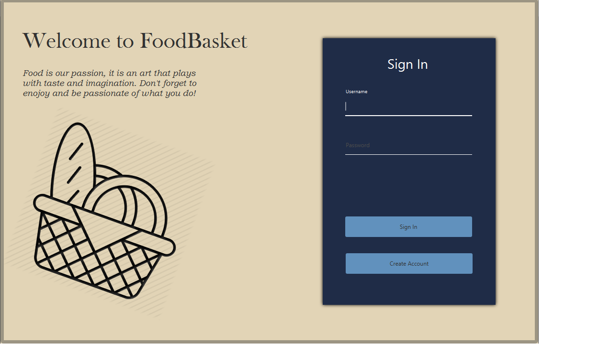
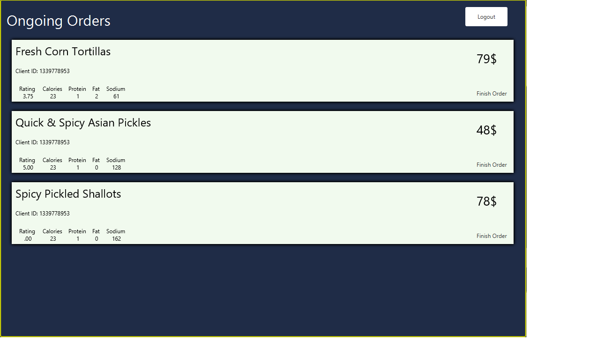

## Food Delivery Management System

**1. Introduction**

The food delivery management system is designed to address the challenges faced by a catering company in managing their food delivery service. The system allows clients to order products from the company's menu, while providing three types of users: administrator, regular employee, and client. This assignment aims to provide a brief overview of the system.

**2. Problem Analysis and Modeling**

The problem analysis reveals the need for an organized and efficient food delivery service. The system is divided into three main parts: Client, Employee, and Admin. Each part plays a critical role in the overall system. The client creates orders, the employee handles the orders, and the admin oversees the products and service quality.

**3. Application Parts**

The application is divided into the following parts:

a) **Client Part:** The client can create an account, log in, view available products, and create orders. A checkout page shows the order summary.

b) **Employee Part:** The employee can create an account, log in, and view active orders. They can mark orders as completed.

c) **Admin Part:** The admin manages the service by viewing and editing products. They also have access to reports on the system's performance.

**4. Design Patterns**

In the design of the food delivery management system, two design patterns are used:

a) **Layered Architecture:** The system follows a layered architecture, consisting of the following layers:

- Presentation Layer: Responsible for UI presentation and user interaction.
- Business Layer: Handles the application's logic and functional requirements.
- Data Access Layer: Manages data manipulation and persistence.

b) **Observer Pattern:** The Observer design pattern is employed to provide real-time updates to the users about the status of their orders. When an order is marked as completed by an employee, the client and admin are notified.

**5. User Interface**

The user interface (UI) plays a crucial role in the food delivery management system. It is implemented using JavaFX, with the following main windows for each user role:

- **Client UI:** Allows clients to create an account, log in, view products, add items to the cart, and proceed to checkout.
- **Employee UI:** Enables employees to create an account, log in, and manage active orders, marking them as completed.
- **Admin UI:** Provides admins with functionalities to manage products, including loading, viewing, editing, and creating new products. It also offers the ability to generate reports.

**6. Conclusion**

The food delivery management system addresses the challenges faced by a catering company in organizing their delivery service. By utilizing design patterns such as Layered Architecture and Observer, the system achieves a structured and efficient implementation. The user interface enhances the user experience, enabling seamless interactions for clients, employees, and administrators.

Please note that the above overview is a concise summary and does not include detailed elements such as class decisions, UML diagrams, or data structures.